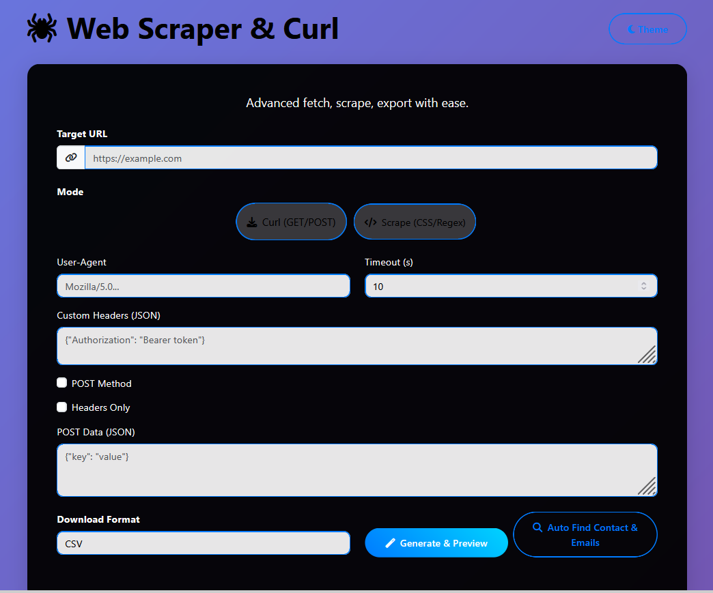
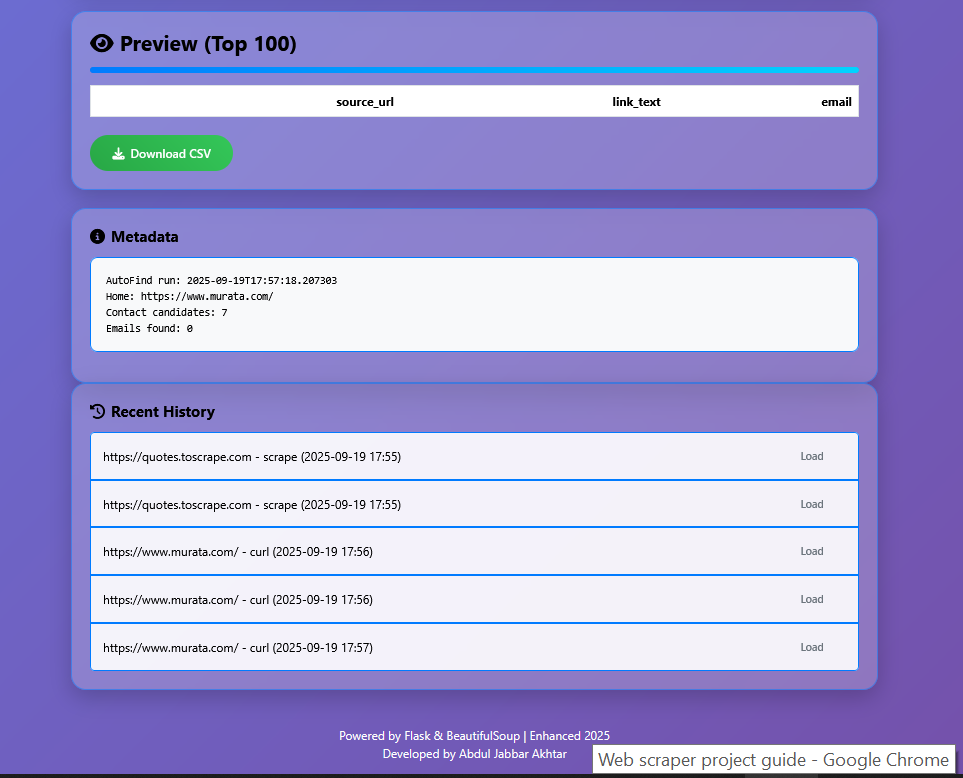

# 🕷️ Enhanced Modern Web Scraper & Curl Platform  

A powerful **Flask + Bootstrap web application** for scraping websites, fetching API responses (cURL-like), and auto-finding **emails & contact pages** with ease.  

## ✨ Features  
- 🔎 **Scraper Mode**: Extract text using CSS selectors & optional regex.  
- 🌐 **Curl Mode**: Perform GET/POST requests with custom headers, JSON payloads, or headers-only fetch.  
- 📧 **Auto-Find Contacts**: Automatically locate contact pages & extract emails.  
- 📂 **Export Options**: Download results as **CSV, JSON, TXT, or Excel**.  
- 🎨 **Beautiful UI**: Responsive design with glass effects, vibrant buttons, and **3 themes**:  
  - Light (gradient bg, dark text)  
  - Dark (black bg, white text)  
  - Dark-Alt (white bg, black text)  
- 🛠️ **Advanced Settings**:  
  - Custom User-Agent  
  - Timeout control  
  - POST method toggle  
  - Unique results & whitespace cleaning  
HEAD

## 📸 Screenshots

### Home Page


### Results Page

 
aadeaf3 (Clean README with screenshots and setup guide)


## 🚀 Quick Start  

### 1. Clone repo  
```bash
git clone https://github.com/developer-AJabbar/enhanced-web-scraper.git
cd enhanced-web-scraper

## 📜 License

This project is **proprietary and confidential**.  
You may not use, copy, modify, or distribute this code without prior written consent from the author.

